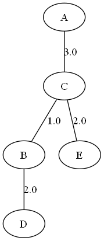
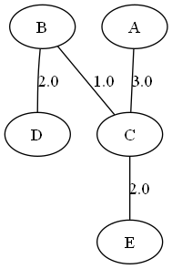
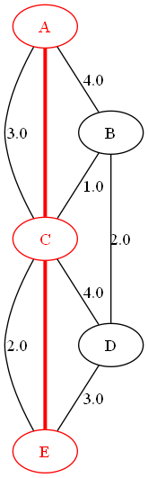
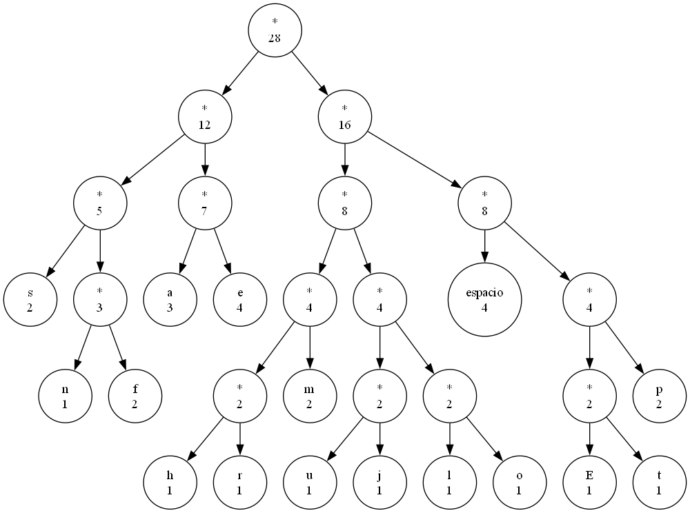
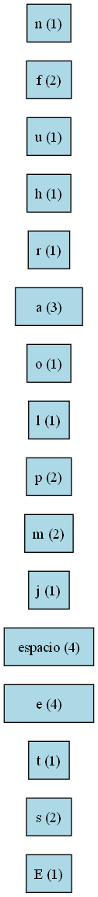

#  PROYECTO FINAL – ANÁLISIS DE ALGORITMOS  
### Universidad Da Vinci de Guatemala

---

## 📚 Información del Estudiante
- **Nombre:** Jorge Estuardo Rustrian del Pinal
- **Carnet:** 202404318 
- **Curso:** Análisis de Algoritmos  
- **Catedrático:** Cesar Sazo
- **Semestre / Año:** 2025
- **Link de youtube:** https://youtu.be/alMWvRc9mxI

## 🎯 **Objetivo General**

*Desarrollar un sistema en Python que implemente los algoritmos de Prim, Kruskal, Dijkstra y Huffman, utilizando archivos externos como entrada, generando representaciones visuales en PNG.*

---

## 🎯 **Objetivos Específicos**

- Implementar los algoritmos de **Árbol de Expansión Mínima** (Prim y Kruskal) leyendo grafos desde archivos CSV.
- Desarrollar el algoritmo de **Dijkstra** para obtener caminos mínimos desde un nodo origen.
- Construir el algoritmo de **Huffman**, generando:
  - Tabla de códigos
  - Representación textual del árbol
  - Imagen PNG del árbol y frecuencias
- Integrar un **menú interactivo** que permita ejecutar cada algoritmo de manera independiente.
- Generar y sobrescribir automáticamente las **imágenes PNG** correspondientes a cada algoritmo.
- Mantener una **arquitectura modular**, separando la lógica de cada algoritmo en archivos independientes dentro de `/src`.


#  Explicación Teórica de los Algoritmos

---

## 🟦 1. Algoritmo de Prim

El algoritmo de **Prim** construye un **Árbol de Expansión Mínima (MST)** seleccionando siempre la **arista más barata** que conecta un nodo ya visitado con un nodo que aún no pertenece al árbol.

###  Funcionamiento
1. Se elige un nodo inicial cualquiera.
2. Se marca como visitado.
3. En cada paso:
   - Se buscan todas las aristas que salen del conjunto de nodos visitados.
   - Se selecciona la arista de **menor peso**.
   - Se agrega el nuevo nodo al MST.
4. Se repite hasta conectar todos los nodos del grafo.

Prim funciona similar a "ir creciendo un árbol" desde un punto, siempre expandiendo con la conexión más barata posible.

###  Complejidad del Algoritmo de Prim (implementación utilizada)

La implementación realizada utiliza listas de adyacencia y una búsqueda lineal
para seleccionar la arista de menor peso en cada iteración.  
Esto implica que no se emplea una cola de prioridad (min-heap).

Por lo tanto, la complejidad temporal es:

**O(V²)**

donde V es la cantidad de nodos del grafo.

---

## 🟩 2. Algoritmo de Kruskal

El algoritmo de **Kruskal** también construye un **Árbol de Expansión Mínima (MST)**, pero lo hace seleccionando aristas en orden ascendente **sin importar desde qué nodo se parte**.

### 🔍 Funcionamiento
1. Se ordenan todas las aristas del grafo según su peso.
2. Se recorre esta lista y se toma la arista más barata que **no forme un ciclo**.
3. Para detectar ciclos, se utiliza la estructura **Union-Find**:
   - `encontrar()` determina a qué conjunto pertenece un nodo.
   - `unir()` fusiona conjuntos cuando se agrega una arista válida.
4. Se repite hasta formar un MST con *V − 1* aristas.

Kruskal es muy eficiente cuando el grafo tiene muchas aristas dispersas y no está muy conectado.

###  Complejidad
- Ordenamiento de aristas: **O(E log E)**  
  (equivalente a **O(E log V)**)


**Complejidad total:**  
**O(E log V)**

---

## 🟧 3. Algoritmo de Dijkstra

Dijkstra encuentra el **camino más corto** desde un nodo origen hacia todos los demás nodos del grafo.  
Funciona para grafos con **pesos positivos**.

###  Funcionamiento
1. Inicializa todas las distancias en infinito excepto el nodo origen.
2. Usa una **cola de prioridad (min-heap)** para seleccionar el nodo "más cercano" aún no procesado.
3. Por cada vecino del nodo actual:
   - Se calcula si un camino alternativo (relajación) es mejor.
   - Si es mejor, se actualiza la distancia y el padre del nodo.
4. Continúa hasta procesar todos los nodos alcanzables.

Dijkstra siempre expande caminos de forma óptima gracias a su manejo de distancias mínimas.

###  Complejidad
- Con lista de adyacencia + **min-heap**:  
  **O(E log V)**


---

## 🟥 4. Algoritmo de Huffman

Huffman genera un **código óptimo de compresión sin pérdidas**, asignando códigos más cortos a los símbolos más frecuentes.

### 🔍 Funcionamiento
1. Se cuentan las frecuencias de cada carácter.
2. Se coloca cada carácter en un **min-heap** ordenado por frecuencia.
3. Se extraen los dos nodos de menor frecuencia y se combinan en un nodo padre.
4. Se repite hasta quedar solo un nodo: la raíz del **árbol de Huffman**.
5. Para generar los códigos:
   - Se recorre el árbol asignando:
     - `0` al hijo izquierdo  
     - `1` al hijo derecho
6. Las hojas contienen los códigos finales.

El resultado es un código **prefijo**: ningún código es prefijo de otro, garantizando decodificación única.

### Complejidad
- Construcción del heap: **O(n)**
- Construcción del árbol (n inserciones/extracciones): **O(n log n)**
- Generación de los códigos recorriendo el árbol: **O(n)**

**Complejidad total:**  
**O(n log n)**  
donde *n* es la cantidad de símbolos únicos.

---

# 📌 Resumen de Complejidades

| Algoritmo | Complejidad |
|-----------|-------------|
| **Prim** | O(E log V) |
| **Kruskal** | O(E log V) |
| **Dijkstra** | O(E log V) |
| **Huffman** | O(n log n) |

## 📥 Formato de Entrada

### 1. Archivo CSV para los algoritmos de Prim, Kruskal y Dijkstra

El archivo debe ser un **CSV sin comillas**, con tres columnas obligatorias:

- **origen** → nodo inicial  
- **destino** → nodo conectado  
- **peso** → valor numérico (entero o decimal)  
- El grafo debe ser **no dirigido** y **ponderado**.  
- Se permiten letras, números o cualquier nombre textual como identificador de nodo.

---

### 🟦 2. Archivo TXT para el algoritmo de Huffman

El archivo debe contener **solo texto plano**, por ejemplo:
Este texto lo usara huffman.py


# ▶️ Ejecución del Programa

Para ejecutar el proyecto, abrir una terminal en la carpeta raíz del proyecto y ejecutar:

```bash
python main.py
```
1. **Cargar grafos desde archivo CSV**
  - Se lee el archivo ubicado en /grafos/grafos.csv
/docs/evidencias/prim_mst.png
2. **Se ejecuta prim**
  - Se introduce la opcion 1
  - Construye el arbol de expansion minima
  - Lo muestra por consola
  - lo guarda en: /docs/evidencias/prim_mst.png
  - 

3. **Se ejecuta Kruskal**
  - Se elige la opcion 2
  - Construye el arbol de expansion minima usando encontrar-unir
  - Lo muestra por consola
  - lo guarda en: /docs/evidencias/kruskal_mst.png
  - 
 4. **Se ejecuta Dijkstra**
  - Se elige la opcion 3
  - Calcula la distancia mas corta
  - Reconstruye la distancia mas corta hacia un destino
  - lo guarda en: /docs/evidencias/dijkstra_paths.png
  - 

     4. **Se ejecuta Huffman**
  - Se elige la opcion 4
  - lee el archivo de texto en /textos/huffman.txt

  - Calcula frecuencias
  - Genera tabla de codigos
  - Produce representacion textual
  - lo guarda en: /docs/evidencias/huffman_tree.png  /docs/evidencias/frecuencias.png
  - 
  - 
## Conclusion ## 

    En conclusión, este proyecto me permitió entender de forma práctica cómo funcionan los algoritmos clásicos de grafos y compresión. Implementarlos desde cero, leer archivos externos y generar las representaciones visuales me hizo comprender no solo la teoría, sino también los detalles que se esconden detrás de cada estructura de datos y cada decisión algorítmica. Ver cómo Prim y Kruskal construyen un MST diferente pero con el mismo costo, cómo Dijkstra encuentra rutas óptimas y cómo Huffman comprime texto desde sus frecuencias me deja una visión más clara de la importancia real de estos algoritmos en la computación. El proyecto fue retador, pero cada parte sumó para reforzar mi lógica, orden y capacidad de diseñar soluciones completas


    


